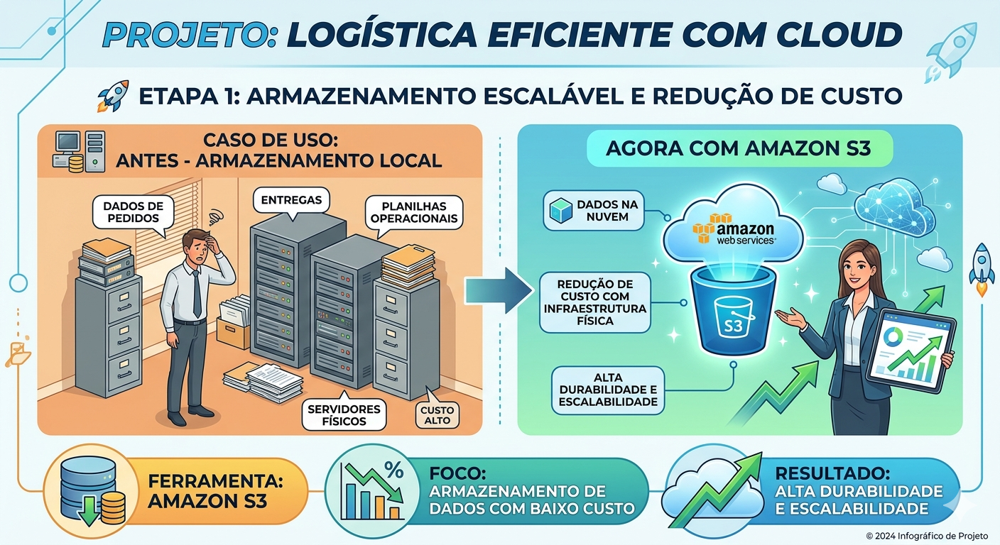
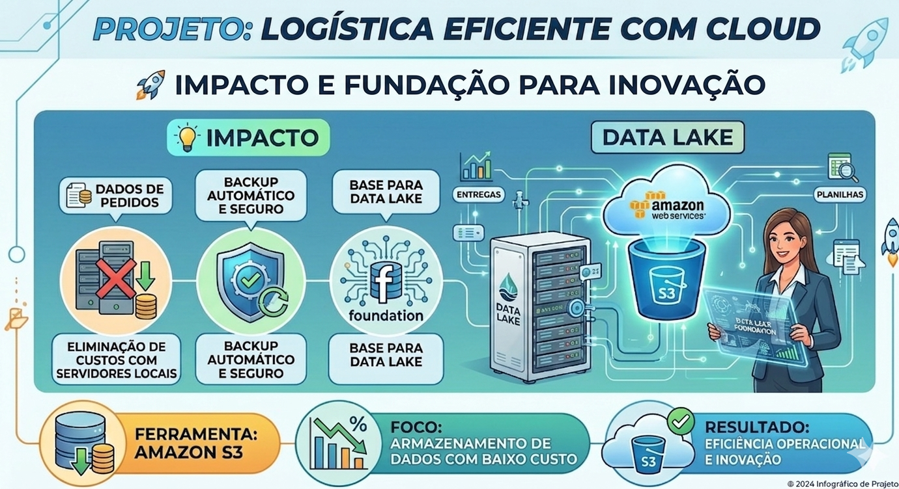
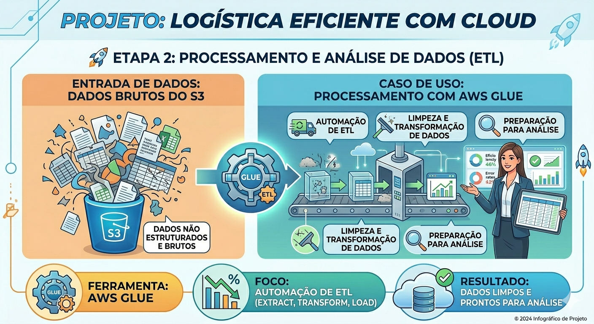
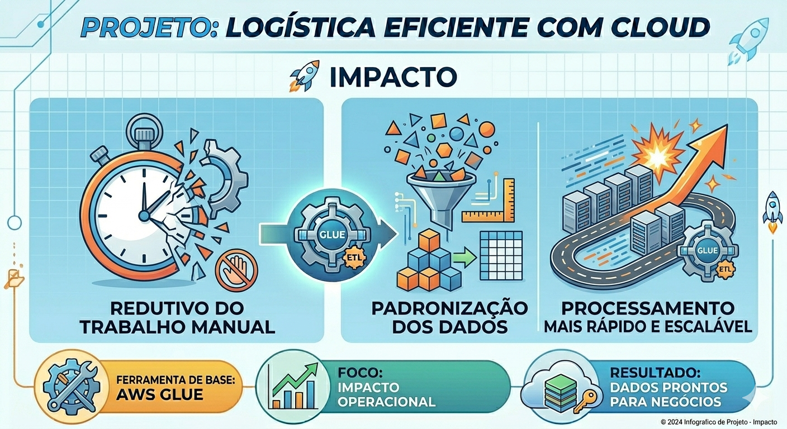
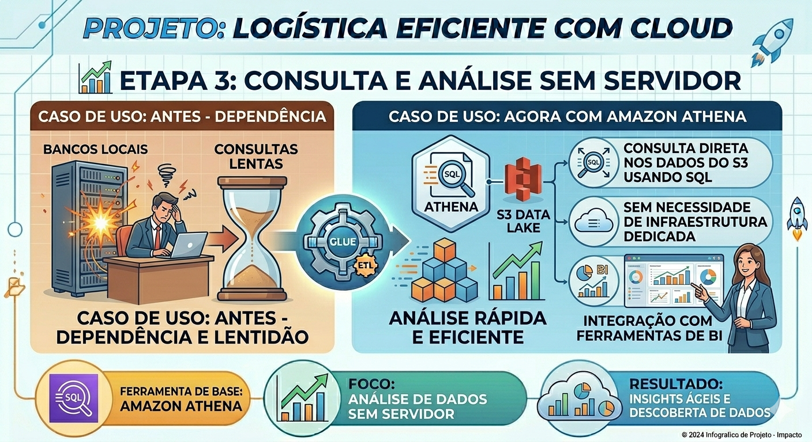
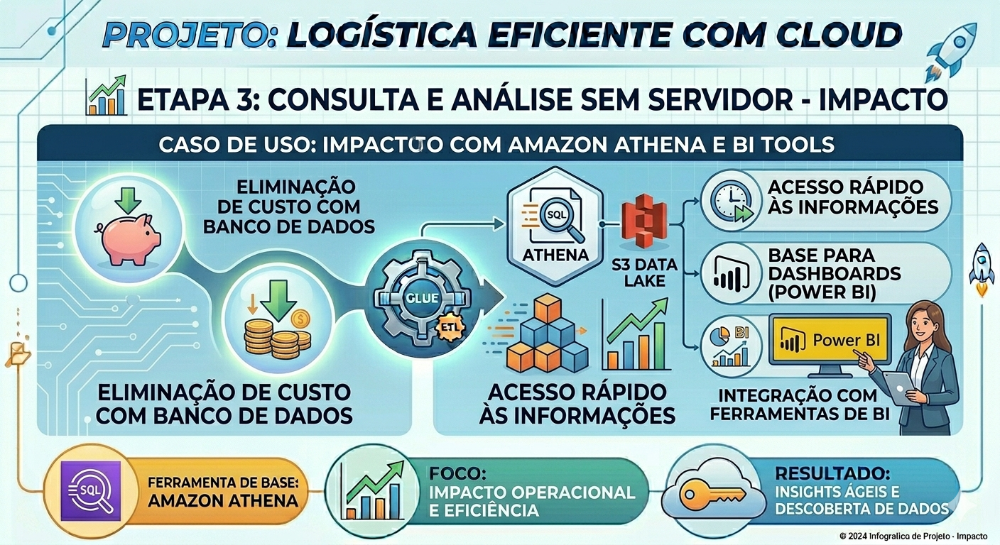

🧩 Descrição do Projeto

O projeto foi dividido em 3 etapas principais:

🚀 Etapa 1: Armazenamento escalável e redução de custo
Ferramenta: Amazon S3
Foco: Armazenamento de dados com baixo custo
Caso de uso:

A empresa utilizava armazenamento local e servidores físicos para guardar dados de pedidos, entregas e planilhas operacionais.

Com a implementação do Amazon S3:

Os dados passaram a ser armazenados na nuvem
Redução de custo com infraestrutura física
Alta durabilidade e escalabilidade

💡 Impacto:

Eliminação de custos com servidores locais
Backup automático e seguro
Base para Data Lake

⚙️ Etapa 2: Processamento e análise de dados (ETL)
Ferramenta: AWS Glue
Foco: Automação de ETL (Extract, Transform, Load)
Caso de uso:

Os dados armazenados no S3 eram brutos e não estruturados.

Com o AWS Glue:

Criação de pipelines de dados automatizados
Limpeza e transformação dos dados
Preparação para análise

💡 Impacto:

Redução de trabalho manual
Padronização dos dados
Processamento mais rápido e escalável

📊 Etapa 3: Consulta e análise sem servidor
Ferramenta: Amazon Athena
Foco: Análise de dados sem necessidade de servidor
Caso de uso:

Antes, a empresa dependia de bancos locais e consultas lentas.

Com o Amazon Athena:

Consulta direta nos dados do S3 usando SQL
Sem necessidade de infraestrutura dedicada
Integração com ferramentas de BI

💡 Impacto:

Redução de custo com banco de dados
Acesso rápido às informações
Base para dashboards (Power BI)

✅ Conclusão

A implementação dos serviços da Amazon Web Services na Abstergo Industries proporcionou:

Redução significativa de custos com infraestrutura
Maior escalabilidade e flexibilidade
Automatização de processos de dados
Melhoria na tomada de decisão baseada em dados

A adoção dessas soluções fortalece a empresa para crescer de forma sustentável e orientada a dados.

Recomenda-se:

Evoluir para ferramentas de visualização (Power BI / QuickSight)
Implementar monitoramento com CloudWatch
Expandir a arquitetura para tempo real futuramente

📎 Anexos
Diagrama da arquitetura AWS
Scripts Python (ETL)
Queries SQL (Athena)
Dashboard Power BI
Dataset utilizado (estacionamento / logística BH)

✍️ Assinatura do Responsável
    Walisson Patrick Helmer